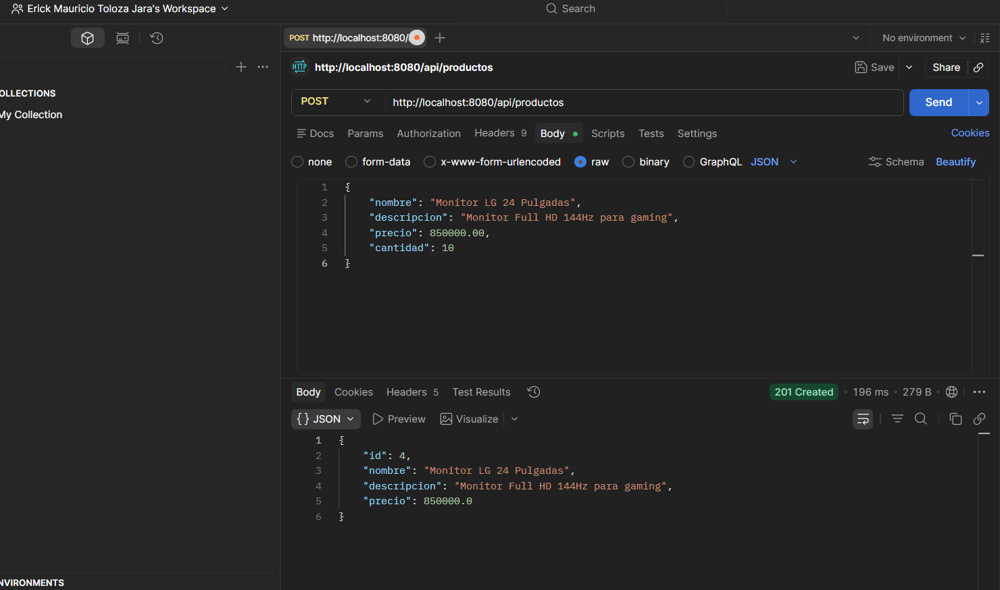
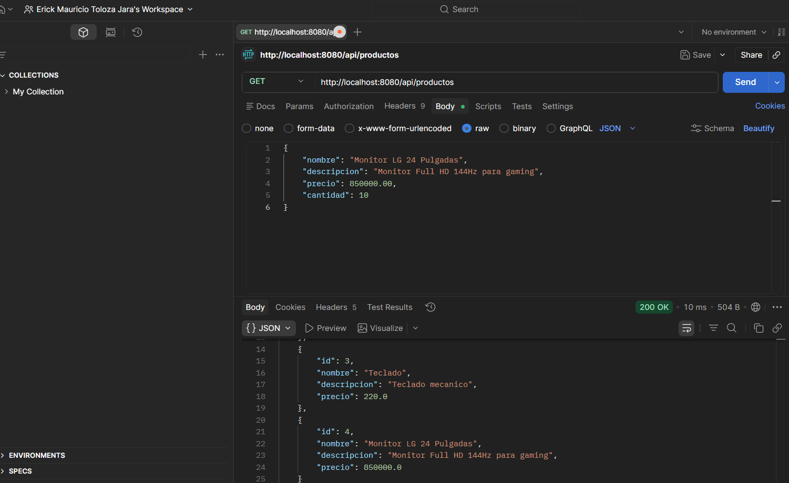
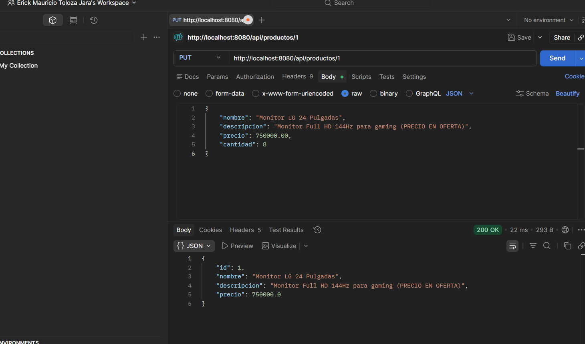

# U7 PostContenido 2 - API REST CRUD de Productos

API REST con Spring Boot y `@RestController` para operaciones CRUD en memoria.

## Requisitos
- Java 17+
- Maven 3.8+

## Ejecutar
```bash
mvn spring-boot:run
```

Base URL:
- `http://localhost:8080/api/productos`

## Endpoints
- `GET /api/productos`
- `GET /api/productos/{id}`
- `POST /api/productos`
- `PUT /api/productos/{id}`
- `DELETE /api/productos/{id}`

## Entrega GitHub
Nombre sugerido: `apellido-post2-u7`

## Capturas de Pruebas de la API REST (Postman)

**1. Creación de un Producto (Petición POST):**


**2. Obtención del Catálogo (Petición GET):**


**3. Modificación/Eliminación (Petición PUT/DELETE):**
